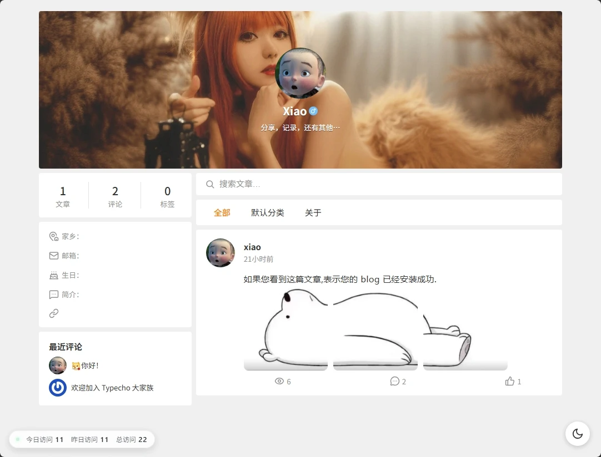

# WeiBo-X

一款仿微博风格的 Typecho 主题，简洁清爽，支持丰富的自定义配置。

## 说明

主题设计致力于提供干净简洁的阅读体验，同时保持较高的可定制性。

本主题 **WeiBo-X** 基于 [typecho-sagittarius](https://github.com/xiayuanOvO/typecho-sagittarius)（原作者：[夏源](https://blog.xiayuanovo.cn)）修改而来，当前版本 **v1.0.0** 由 [Xiao](https://be.de.cool) 维护，在原版基础上做了大量功能增强与重构，详见下方「与原版的主要差异」。

为避免与原版 typecho-sagittarius 的后续更新相混淆，本主题更名为 **WeiBo-X**，独立维护与发布。

## 特性

- **微博流式布局**：时间线式文章列表，沉浸式阅读体验
- **高度自定义**：保持较高的可定制性
- **明暗双主题**：手动切换 + 跟随系统，偏好本地记忆
- **代码高亮**：Prism.js 语法高亮，支持行号与一键复制
- **访问统计**：站点级访客统计条，支持自动刷新与悬停气泡
- **首页评论**：无需跳转文章页，在首页直接发表/回复评论
- **点赞/浏览量**：文章点赞（可取消）与浏览量统计
- **图片灯箱**：文章内容图与卡片图片点击放大，支持左右切换与键盘操作
- **OwO 表情**：评论支持 OwO 表情面板与表情码渲染
- **响应式设计**：适配桌面端与移动端

## 与原版的主要差异

### 新增功能

- **明暗双主题**：一键切换亮/暗模式；首次访问跟随系统偏好（`prefers-color-scheme`），手动切换后记忆在浏览器 `localStorage`
- **访问统计**：基于 SQL 的站点级访客统计（IP + UA 指纹同人同日去重，爬虫不计入），今日/昨日/总访问计数；支持侧边栏内联或视口四角悬浮展示，可选自动刷新（10 秒 ~ 5 分钟，基于轻量 JSON 接口轮询且不计访问），悬停查看近 7 天/近 30 天数据，统计时区可配置（默认北京时间，不受服务器时区影响）
- **首页内联评论**：首页卡片下方直接展示最新 5 条评论并可发表/回复，评论者认证（登录态/访客 Cookie/评论开关）与文章页共用同一份实现；访客信息跨页记忆；评论过 5 条显示「查看更多」
- **点赞可取消**：再次点击已赞按钮可取消点赞，状态记忆在浏览器本地，并做防连点保护
- **图片灯箱**：文章内容图与首页卡片图片点击弹出灯箱查看原图，带上一张/下一张图标按钮（首页灯箱仅浏览当前文章的图片）与 `←`/`→` 键盘导航，点击空白处或 `Esc` 关闭；原生实现无第三方依赖
- **OwO 表情**：评论框表情面板（文章页 + 首页），评论中的 `{:表情码:}` 自动渲染为表情图片；面板采用 fixed 定位智能翻转，避免被容器裁剪
- **文章标签**：文章底部显示标签胶囊链接
- **友链 LOGO**：友链列表支持第四段 LOGO 地址（`名称|链接|描述|LOGO地址`），自动圆形裁剪展示；友链输入框改为多行文本域
- **页面浏览量**：文章页浏览量计数（会话 Cookie 去重），列表页/文章页操作栏均展示
- **外链新窗口**：正文中的站外链接自动新窗口打开并加 `noopener noreferrer`
- **搜索框**：内容区顶部新增文章搜索框
- **后台设置增强**：设置页生成锚点侧边栏、Ctrl+S 快捷保存、背景模式联动显隐

### 行为调整

- **视频播放器**：适配 VideoCollector 插件，首页摘要提取第一个播放器（去除分集按钮）供列表直接播放
- **摘要渲染**：自定义摘要函数，剔除播放器/脚本/样式后仅保留行内文字样式标签，按可见字符截断并自动闭合标签
- **九宫格图片**：文章图片最多展示 9 张（3×3 网格），无图不渲染容器
- **分类标签栏**：Tab 栏追加独立页面入口；溢出时横向滚动 + 滚动条隐藏 + 右缘渐隐遮罩
- **评论者昵称**：填写网址时渲染为外链（自动补协议、拦截非法协议、`nofollow`）
- **头像源**：默认头像源更换为 `api.lty.fun`
- **加载方式**：移除原版 swup 页面转场与 swiper，改为常规整页加载；首页瀑布流加载更多扩展至所有归档页

### 重构与工程化

- **评论接口重写**：`action/comments.php` 独立端点补齐核心引导（`Init::alloc()`）并统一 Cookie 前缀（修复跨页身份不一致），POST 分支走 `Feedback` 保留 token 反垃圾、评论审核与插件钩子
- **评论容器合并**：文章页与首页内联评论合并为 `components/comments.php` 单一实现，评论列表渲染、认证逻辑只此一份
- **插件钩子补齐**：`header.php` / `footer.php` 补充 `$this->header()` / `$this->footer()` 调用，兼容各类插件资源注入
- **静态资源重组**：合并为单文件 `main.min.css` / `app.js`（带文件时间戳缓存版本号），移除 gulp 构建链（gulpfile/package.json/style.css/多模块 css/js）；Prism.js 改用国内 CDN 镜像（含行号、工具栏、复制功能）
- **移除顶部导航**：删除原版顶部 nav 导航栏及其设置项，页面入口整合进 Tab 栏
- **后台样式内联**：主题设置页样式与脚本改为 functions.php 内联输出，移除 admin.css/admin.js

## 环境要求

- Typecho 1.2+
- PHP 7.4+

## 安装

1. 下载主题压缩包或克隆仓库
2. 解压到 `usr/themes/` 目录
3. 登录 Typecho 后台 → 控制台 → 外观
4. 启用「WeiBo-X（Sagittarius Theme 修改版）」主题

## 推荐插件

- **[VideoCollector](https://github.com/imxiaoxp/VideoCollector)**：视频采集插件——在 Typecho 后台从苹果 CMS 标准采集 API 搜索影视资源，一键生成 `[play]` 短代码嵌入多分集视频播放器（ArtPlayer / Iframe 双播放模式），即使不使用采集功能，也可以用短代码插入视频。
- **[APlayer-Typecho](https://github.com/MoePlayer/APlayer-Typecho)**：音乐播放插件——通过编辑器音乐按钮或 `[Meting]` 短代码插入网易云 / QQ 音乐等平台的单曲、专辑、歌单，或自定义歌曲（下载后需将插件文件夹改名为 `Meting`）。主题已适配：文章插入音乐后，首页卡片直接展示 APlayer 播放器，并完整支持主题暗色模式。

## 许可证

本项目基于 [GNU General Public License v3.0](LICENSE) 开源。

感谢使用❤，如果觉得主题还不错，可以到原作者[xiayuanOvO](https://github.com/xiayuanOvO/typecho-sagittarius)项目上点个Star~

